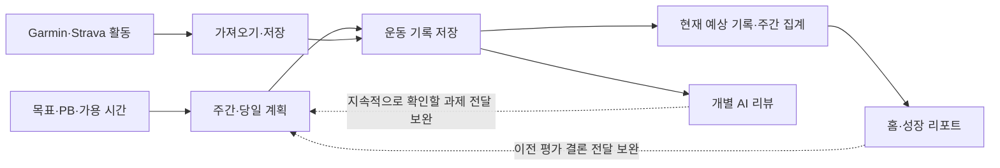

# 목표 달성 가능성·성장 추적 중심 사용자 여정 검토

검토일: 2026-09-13 · 대상: 현재 작업 폴더의 React PWA(`web/`)와 FastAPI(`api/`)

사용자가 확인한 최우선 목적은 **목표 달성 가능성을 판단하고, 실제 성장을 추적하는 것**이다. 목표 사례는 2026-11-01 풀마라톤 3:30:00이다. 아래 재현 수치는 데모·합성 데이터의 결과이며 사용자의 현재 실력 판정이 아니다.

## 1. 판단

**계획을 만들고 운동을 기록하는 기본 흐름은 갖춰져 있다. 목표 달성 판단과 장기 성장 추적은 데이터의 완전성, 비교 기준, 해석 방식부터 보완해야 한다.**

홈에서 목표와 현재 값을 함께 보여주는 방향, 일정·컨디션을 반영하는 계획, 기록 저장과 AI 리뷰를 분리한 구조는 유지할 가치가 있다. 그러나 현재 예상 기록은 최근 운동량과 기준 기록을 환산한 값이다. 남은 기간 동안 어떤 훈련을 할 수 있고 얼마나 변화할지를 예측하는 모델은 없다. 목표일까지의 직선은 요구되는 변화량을 표시하며, 그 변화의 실현 가능성을 검증하지 않는다.

따라서 현재 화면만으로는 다음 세 질문에 충분히 답하기 어렵다.

1. **지금 판단할 근거가 충분한가?** 기록 누락·연동 미반영과 실제 미훈련이 구분되지 않는다.
2. **실제로 성장했는가?** PB 변경으로 과거 그래프가 다시 쓰이고, 훈련량 변화와 실력 변화가 섞인다.
3. **목표에 가까워지려면 다음에 무엇을 바꿔야 하는가?** 격차 표시는 있으나 원인 → 선택 → 계획 반영 → 다음 평가의 연결이 약하다.

우선순위는 **기록 보존·반영 → 판단 가능한 데이터인지 표시 → 비교 가능한 이력 → 변화 설명과 다음 계획 연결**이다.

## 2. 사용자 여정별 평가

| 여정 | 사용자가 얻어야 하는 것 | 현재 구성·강점 | 끊기는 지점 | 개선 방향 |
|---|---|---|---|---|
| 첫 진입·목표 설정 | 목표와 현재 출발점 확인 | 프로필·PB·목표·기본 시간표 입력 | PB 날짜, 최근 기록의 수집 범위, 초기 판단 가능 여부를 확인하지 않음 | 목표 입력 후 기록 연결/가져오기와 데이터 상태 확인 |
| 매일 홈 확인 | 목표 상태·변화 이유·오늘 할 일 | 목표 격차, 12주 궤적, 준비도, 오늘 요약 | 기록이 없어도 정밀한 수치와 과거 궤적이 나타남. 다음 행동은 별도 카드 | 데이터 상태 → 근거 기반 판단 → 변화 이유 → 우선 행동 순서 |
| 주간 계획 | 가용 시간 안에서 목표를 향한 일주일 | 기본 시간표와 이번 주 일정·컨디션 입력, 완료 세션 보존 | 이전 코칭 결론이 다음 계획 입력에 명시적으로 이어지지 않음 | 이번 주 목적과 지난 피드백 반영 사항 표시 |
| 운동 직전 | 지금 상태에 맞는 실행 계획 | 컨디션 입력, 당일 상세 생성, 조정 결과의 주간 반영 | 상세 생성 후 같은 화면에서 컨디션을 다시 입력할 경로가 없음 | 오늘 카드에 ‘컨디션 변경’과 변경 전후 확인 |
| 운동 직후 | 실제 수행을 빠짐없이 저장 | 직접 입력·연동 채우기·이미지 분석, 계획 밖 훈련 추가 | 하루 한 기록, 연동 활동도 날짜당 한 건으로 축약. 부분 수행 판정이 실제 수행량과 다름 | 운동 단위 기록, 추가와 수정 구분, 수행 상태 명시 |
| 주말 회고 | 무엇이 좋아졌고 다음 주 무엇을 바꿀지 | 수행률·거리·코치 메시지·상세 분석 | 성장 근거가 주간 거리·완료 수에 집중. 지난 리포트 비교 경로가 약함 | 주간 비교, 변화 원인, 다음 주 실행 항목 저장 |
| 수주 뒤·목표 수정 | 비교 가능한 성장과 현실적인 목표 선택 | 최근 12주 예상 기록, 설정에서 목표 수정 | 현재 PB·목표로 과거를 재계산. 수정 이전 기준을 확인하기 어려움 | 목표 버전과 당시 평가 보존, 체크포인트·대회 회고 |

검토한 사용자 흐름의 데이터 경계:

연동 활동은 외부 활동 저장소에 들어온 것만으로 `운동 기록 저장` 단계를 통과하지 않는다. 이 경계를 사용자가 이해하고 누락 없이 마칠 수 있어야 한다.

## 3. 우선 개선 사항과 완료 기준

P0는 이 서비스의 핵심 판단을 믿기 위한 선행 조건, P1은 성장 이해와 행동 연결, P2는 이후 확장이다. 보안 장애의 심각도 등급이 아니다.

### J01 · P0 · 데이터 부족 상태와 예상 기록의 의미를 구분

**확인:** 운동 로그가 없는 데모 입력에서도 예상 `4:52:15`, 스피드 `100`, 지구력 `0`, 과거 점 `12개`가 생성된다. PB 사용 안내는 이미 있지만 주된 수치·그래프와 함께 나타나므로 실제 관측된 성장 이력으로 읽힐 수 있다. 반대로 PB도 없으면 산출 불가 상태는 구현되어 있다.

**근거:** [원시 결과](evidence/journey-review-2026-09-13/math.json)의 `no_logs`. [PB 후보 구성](../api/app/services/fitness.py#L170), [12주 재계산](../api/app/services/progress.py#L64), [목표 카드 문구](../web/src/tabs/Home.jsx#L58), [그래프 표시 조건](../web/src/tabs/Home.jsx#L105).

**개선:** ‘데이터 부족 / PB 참고 추정 / 최근 기록 기반’ 상태를 카드 상단에서 구분한다. 기록 수·관측 기간·마지막 반영일을 함께 보여준다. 최근 기록이 없으면 지구력 0을 실력 판정처럼 표시하지 않는다. 현재 계산값에는 ‘현재 기록 기준 추정’이라는 의미를 부여하고 목표일 전망과 구분한다.

**완료 기준:** 로그 없는 계정에서 실제 성장 이력처럼 보이는 12주 실선이나 목표 달성 단정 문구가 나오지 않는다. PB만 있을 때는 날짜 미상 여부와 참고 추정임을 표시한다. 실측 근거가 부족하면 달성 확률 수치를 만들지 않으며, 필요한 다음 입력으로 이동할 수 있다. 데이터 충분성의 기준은 명시적으로 정하고 테스트한다.

### J02 · P0 · 연동 활동이 성장 판단에 빠지는 경계를 해결

**확인:** 테스트 DB에 Garmin 외부 활동 12km를 넣어도 대시보드 주간 거리는 `0`, 예상 기록은 `4:52:15`로 유지됐다. 계산 입력이 `WorkoutLog`만 조회하기 때문이다. 연동의 현재 역할은 기록 폼의 자동 채우기이며, 자동으로 모든 훈련이 반영되는 구조가 아니다.

**근거:** [API 결과](evidence/journey-review-2026-09-13/api.json)의 `cached_external_activity`. [입력 조회](../api/app/services/progress.py#L19), [연동 활동 목록](../api/app/routers/integrations.py#L202), [가져오기 시트](../web/src/components/AddRunSheet.jsx#L49).

**개선:** 홈에 ‘미반영 활동 N건’과 반영 작업을 제공한다. 초기에는 일괄 확인 후 가져오기 방식이 적합하다. 사용자가 자동 반영을 선택하면 동일한 정규 운동 기록으로 저장하고, 추가 소감·통증 입력은 나중에 보완할 수 있게 한다. 두 저장소를 단순 합산하면 중복이 생기므로 같은 운동의 식별이 먼저다.

**완료 기준:** 한 외부 러닝을 반영하면 거리·최근 훈련·대시보드에 한 번만 반영된다. 재동기화와 재가져오기로 중복이 생기지 않는다. Garmin·Strava 양쪽에서 들어온 동일 운동을 처리할 수 있다. 동기화 실패, 최근 동기화 시각, 미반영 건수가 사용자에게 구분되어 보인다.

### J03 · P0 · 하루 여러 운동을 보존하고 추가와 수정을 분리

**확인:** 같은 날 1km 기록 다음 8km 기록을 POST하면 같은 ID, `created=false`, 저장 건수 `1`, 합계 `8km`가 된다. API의 날짜 단위 upsert는 기존 설계이며, 실제 여러 운동을 표현하기에는 부족하다. 추가 시트도 날짜를 키로 연동 활동을 한 건만 남기고 이미 기록한 날짜는 제외한다.

**근거:** [API 결과](evidence/journey-review-2026-09-13/api.json)의 `same_day_second_run`. [하루 한 기록 제약](../api/app/db.py#L159), [날짜 upsert](../api/app/routers/workout_logs.py#L84), [활동 축약](../web/src/components/AddRunSheet.jsx#L64).

**개선:** 실제 운동에 독립 ID를 주고 일별 합계는 집계로 만든다. UI에서 ‘새 운동 추가’와 ‘이 기록 수정’을 구분한다. 계획과의 연결은 선택적으로 유지하고, 여러 실제 운동이 한 계획에 연결될 수 있게 한다. 기존 기록 수정 시 그 기록에 연결된 리뷰의 갱신 필요 여부도 처리한다.

**완료 기준:** 같은 날 두 운동 1km·8km가 두 건, 합계 9km로 남는다. 한 건을 수정해도 다른 건이 유지된다. 기존 하루 한 기록 데이터와 리뷰·계획 연결을 보존하는 마이그레이션 검증이 통과한다. 날짜가 같다는 이유만으로 서로 다른 외부 운동을 중복 처리하지 않는다.

### J04 · P0 · 과거 평가와 목표 변경 이력을 보존

**확인:** 운동 추가 없이 PB만 `42:13 → 40:00`으로 바꾸자 과거 첫 점이 `4:52:15 → 4:36:55`, 목표 시작점이 `17,535초 → 16,615초`로 바뀌었다. 매 조회 때 최신 PB로 과거를 재계산한다. 목표 수정도 활성 목표 행을 덮어쓰므로 목표 변경 전후를 비교하기 어렵다.

**근거:** [산식 결과](evidence/journey-review-2026-09-13/math.json)의 `pb_edit_rewrites_past`. [앵커·시계열 계산](../api/app/services/progress.py#L45), [목표 수정](../api/app/routers/profile.py#L87). [대시보드 설계](V2_DASHBOARD.md)는 앵커 고정을 의도하지만 현재 구현에서는 값이 고정 저장되지 않는다.

**개선:** 평가 시점, 목표 버전, 입력 기준, 계산 버전과 결과를 함께 보존한다. PB는 기록 달성일과 등록·수정 시점을 관리한다. 과거 기록을 정정하여 다시 계산한 그래프가 필요하면 ‘당시 평가’와 ‘현재 데이터로 재계산’을 구분한다.

**완료 기준:** PB를 바꿔도 당시 평가와 당시 목표 기준은 유지된다. 새 목표는 새 버전으로 시작하며 과거 목표를 조회할 수 있다. 기록 정정으로 재계산된 값은 변경 이유와 함께 표시된다. 스냅샷 도입 이전의 과거 값은 소급 추정으로 표시한다.

### J05 · P0 · 예측에 사용할 운동 종류와 데이터 적합성 검증

**확인:** 합성 입력 `kind='other', 40km, 1시간`이 예측 후보에 들어가 풀마라톤 예상값을 `1:03:55`로 바꿨다. 거리와 시간이 있는 기록을 종류와 무관하게 사용한다. 실제 Garmin·Strava 가져오기에는 러닝 유형 필터가 있으므로 이 실험을 ‘자전거가 실제로 자동 유입됐다’는 증거로 해석해서는 안 된다.

**근거:** [산식 결과](evidence/journey-review-2026-09-13/math.json)의 `nonrun_kind_not_filtered`. [모든 로그의 Run 변환](../api/app/services/progress.py#L25), [지구력 입력](../api/app/services/fitness.py#L144), [예측 후보](../api/app/services/fitness.py#L170), [Strava 필터](../api/app/services/strava.py#L101).

**개선:** 운동 종목과 러닝 훈련 종류를 구분한다. 러닝이 확인된 기록만 러닝 거리·예측에 사용하고, 모호한 `other` 기록은 확인할 수 있게 한다. 거리·시간·페이스의 불일치나 비정상 후보는 보존하되 예측 반영을 보류하고 이유를 표시한다.

**완료 기준:** 비러닝 또는 미확인 기록은 러닝 실력 추정치를 개선하지 않는다. 정상 러닝은 기존대로 반영된다. 제외 사유를 볼 수 있고 원본 기록을 수정하여 다시 반영할 수 있다. 기존 `other`를 모두 비러닝으로 단정해 버리지 않는다.

### J06 · P1 · 기록 완료와 계획 수행을 구분

**확인:** 화면에서 6km 계획에 1km를 기록해도 완료로 표시됐다. 서버는 실제 거리·시간 대신 통증 4 이상 여부로 `partial`과 `done`을 결정한다. `partial`도 주간 수행률과 꾸준함 계산에서는 한 건 완료로 센다.

**근거:** [API 결과](evidence/journey-review-2026-09-13/api.json)의 `partial_run_status`. [상태 결정](../api/app/routers/workout_logs.py#L97), [주간 집계](../api/app/services/context.py#L41), [꾸준함 집계](../api/app/services/fitness.py#L233), [리포트 표시](../web/src/tabs/Week.jsx#L244).

**개선:** 기록 여부, 계획 수행 상태, 계획 대비 실제 거리·시간을 별도로 보여준다. 미수행·부분 수행·계획대로 수행·대체 훈련을 사용자 확인과 함께 기록한다. 기존 참여 횟수는 유지할 수 있지만 ‘계획 수행률’과 혼용하지 않는다. 거리만으로 판단할 수 없는 근력·시간 중심 훈련도 처리한다.

**완료 기준:** 6km 중 1km는 실제 1km와 부분 수행으로 표현된다. 참여율이 높아도 계획 이행률이 낮을 수 있음을 화면과 AI 입력이 동일하게 반영한다. 회복을 위한 승인된 계획 변경은 변경된 계획 기준으로 평가하고, 원래 계획도 보존한다.

### J07 · P1 · 변화 원인과 목표일까지의 전망을 설명

**확인:** 합성 시나리오에서 최근 4주 평균 거리가 `60 → 45km`, 최장 롱런은 `30km`로 같을 때 예상 기록이 `3:23:55 → 3:35:14`로 변했다. 산식에는 감량의 이유나 훈련 단계가 들어가지 않는다. 회복·일정 조정으로 계획 자체가 줄어도 홈의 ‘멀어짐’과 원인이 연결되지 않는다. 목표 기록 수준에 관계없이 거리별 요구 볼륨도 고정이다.

**근거:** [산식 결과](evidence/journey-review-2026-09-13/math.json)의 `volume_reduction_scenario`. [입력 모델](../api/app/services/fitness.py#L117), [고정 요구치](../api/app/services/fitness.py#L36), [요구 직선](../api/app/services/fitness.py#L271), [홈 변화 문구](../web/src/tabs/Home.jsx#L38).

**개선:** 먼저 ‘이번 변화는 새 기준 기록 / 최근 운동량 / 기록 정정 / 관측 기간 이동 중 무엇 때문인가’를 설명한다. 계획된 감량·일정 변경은 그래프 사건으로 표시한다. 수치가 나빠졌다는 이유만으로 훈련 실패나 실제 실력 저하라고 단정하지 않는다. 이후 목표일까지의 가용 시간·계획·체크포인트를 포함한 조건부 전망을 별도로 설계한다.

**완료 기준:** 숫자 변화의 입력 근거를 추적할 수 있다. 계획된 감량의 맥락과 추정치 변화가 함께 표시된다. ‘현재 상태 환산값’, ‘목표까지 필요한 변화’, ‘조건부 전망’의 의미가 구분된다. 예측 범위나 달성 확률을 표시하려면 실제 대회 결과를 이용한 오차·보정 검증을 먼저 수행한다. 임의의 확률이나 오차 범위를 붙이지 않는다.

### J08 · P1 · 개별 리뷰·주간 평가를 다음 계획에 연결

**확인:** 리뷰 생성 뒤 다음 계획에 쓰는 최근 이력은 테스트에서 `2026-09-13 이지 런 · 8.0km`만 담았다. 최근 이력에는 거리·페이스·심박·통증·소감 등이 들어가지만 저장된 리뷰의 개선점·회복 판정과 이전 주간 평가 결론을 조회하지 않는다. 주간 계획 생성은 이전 계획·집계와 현재 목표 진척도를 받으므로 맥락이 전혀 없는 것은 아니다.

**근거:** [API 결과](evidence/journey-review-2026-09-13/api.json)의 `next_plan_history_context`. [최근 이력 직렬화](../api/app/services/context.py#L121), [주간 생성 입력](../api/app/routers/weeks.py#L142).

**개선:** 다음 주에 확인할 코칭 과제를 근거 기록, 제안 내용, 반영 상태와 함께 저장한다. 다음 계획 생성에 최근 평가 요약과 미해결 과제를 전달하고, 새 계획에는 반영·보류 이유를 보여준다. 원시 기록을 기준으로 하며 이전 AI 해석을 무조건 사실로 승계하지 않는다.

**완료 기준:** 리뷰에서 선택한 개선 과제가 다음 계획 입력에 포함된다. 다음 계획에서 어느 훈련에 반영됐는지 또는 왜 보류했는지 확인할 수 있다. 다음 평가가 실제 수행을 이용해 그 과제를 다시 확인한다. 긴 대화 기록 전체를 누적 입력할 필요 없이 핵심 근거가 유지된다.

### J09 · P1 · 당일 컨디션 변경과 재조정 진입을 유지

**확인:** `Today`의 컨디션 입력과 생성 버튼은 당일 카드가 없을 때만 나타난다. 생성 후에는 상세 열람만 제공한다. 주간 조정 경로는 별도로 존재한다. API는 당일 카드를 다시 생성할 수 있지만 UI에서 직접 이어지지 않는다.

**근거:** [생성 전 UI](../web/src/tabs/Today.jsx#L55), [생성 후 UI](../web/src/tabs/Today.jsx#L108), [당일 저장·주간 반영](../api/app/routers/daily_plans.py#L56), [주간 조정](../web/src/tabs/Week.jsx#L182).

**개선·완료 기준:** 생성된 카드에서도 ‘컨디션 변경’을 선택할 수 있다. 수정 사유와 입력 시각, 변경 전후 훈련을 확인하고 적용한다. 당일 상세와 주간 세션은 일치하며 이미 완료한 기록·세션은 보존한다. 데이터 부족 안내에서 강한 기록을 권하는 경로도 현재 컨디션·기존 계획과 연결해 검토한다.

### J10 · P1 · 주간 리포트 열람을 장기 성장 비교로 확장

**확인:** 홈은 최근 12주 예상 기록, 8주 거리, 최근 20건 훈련을 제공한다. ‘이번 주’ 탭은 현재 주 리포트에 집중되어 있으며 과거 리포트를 선택·비교하는 화면이 없다. 리포트의 대표 수치도 거리·세션·수행률이다.

**근거:** [홈 데이터와 구성](../web/src/tabs/Home.jsx#L360), [성장 리포트](../web/src/tabs/Week.jsx#L233), [현재 주 조회](../web/src/tabs/Week.jsx#L281).

**개선·완료 기준:** 주·월·목표 기간을 선택하고 당시 평가를 비교한다. 동일한 조건으로 비교 가능한 러닝 기록과 거리·지속 시간 등의 실제 관측값을 먼저 제공한다. 심박·체감 정보는 비교 조건과 데이터 수가 충분할 때 보조 근거로 쓴다. 원인과 다음 행동이 함께 표시되고, 표본이 부족한 지표는 ‘비교 불가’로 남긴다.

## 4. 추가하면 목적에 도움이 되는 기능

| 기능 | 해결하는 사용자 질문 | 최소 범위 | 선행 조건 |
|---|---|---|---|
| 데이터 상태 카드 | 시계로 뛴 기록이 전부 반영됐나? | 마지막 동기화·미반영 건수·관측 기간·누락 확인 | J02·J03 |
| 목표 상태 카드 | 지금 내 목표를 판단할 수 있나? | 판단 가능 여부, 현재 기록 기준 추정, 목표 격차, 근거 | J01·J05 |
| 주간 변화 설명 | 왜 좋아지거나 나빠졌나? | 이전 평가 대비 변화, 입력 근거, 기록 수정·계획 변경 표시 | J04·J06·J07 |
| 다음 행동 카드 | 이번 주 가장 먼저 무엇을 해야 하나? | 미반영 기록 처리·일정 수정·계획 검토 등 우선 행동 한 개와 이동 버튼 | J02·J08·J09 |
| 목표 체크포인트 | 언제 목표를 유지하거나 수정할지 판단하나? | 검토일, 필요한 근거, 목표 유지·수정 이력 | J04·J07 |
| 성장 기록실 | 지난달보다 무엇이 좋아졌나? | 주간 평가 이력, 기간 비교, 원본 훈련으로 이동 | J04·J10 |
| 대회 결과·회고(P2) | 예상과 실제가 얼마나 달랐고 다음 목표는 무엇인가? | 목표 종료, 실제 기록 연결, 오차와 다음 목표 기록 | 목표 버전·평가 이력 |

화면 구조는 현재의 **홈 → 오늘 → 이번 주 → 설정**을 유지해도 된다. 홈 상단에 판단 상태와 다음 행동을 모으고, 긴 그래프·산식은 필요할 때 펼치게 하면 핵심 목적을 더 빨리 달성할 수 있다. 성장 이력이 충분히 늘어나면 별도 성장 화면의 필요성을 실제 사용으로 판단한다.

## 5. 구현 순서와 검증 시나리오

| 순서 | 작업 묶음 | 사용자가 체감할 결과 | 확인할 시나리오 |
|---|---|---|---|
| 1 | J01 데이터 부족 표시 + J05 예측 입력 검증 | 근거 없는 수치가 목표 판단을 대신하지 않음 | 로그 없음, PB만 있음, 미확인 운동, 정상 러닝 |
| 2 | J03 운동 단위 저장 → J02 연동 반영 → J06 수행 정의 | 실제로 한 운동과 계획 이행을 정확히 확인 | 같은 날 2회, 수정, 재동기화, 두 공급자 중복, 6km 중 1km |
| 3 | J04 당시 평가·목표 버전 → J10 비교 화면 | 지난달과 오늘을 같은 기준으로 비교 | PB 변경, 목표 변경, 과거 기록 정정, 소급 계산 표시 |
| 4 | J07 변화 설명 + J08 피드백 전달 + J09 재조정 | 원인을 이해하고 다음 훈련에 반영 | 계획 감량, 새 기준 기록, 미해결 과제, 생성 후 컨디션 변경 |
| 5 | 조건부 전망·체크포인트·대회 회고 | 근거를 쌓아 목표 판단의 정확도를 개선 | 예상과 대회 결과의 오차, 목표 변경 전후 비교 |

운동 단위 저장 변경은 DB·API·PWA와 기존 데이터를 함께 다뤄야 한다. Expo 앱은 현재 옛 기록 탭 구조이므로 API 계약이 바뀌는 단계에서 함께 호환성을 확인한다. 대시보드만 추가하는 작업과 기록 저장 계약 변경을 같은 규모로 취급하지 않는다.

성공 기준은 화면 추가 개수보다 다음 결과로 본다. 초기 사용 데이터를 모으기 전 임의의 목표 비율은 정하지 않는다.

- 반영 대상으로 선택한 외부 활동이 정규 기록에 한 번씩 저장되는가.
- 사용자가 ‘데이터 부족’과 ‘실력 정체’를 구분할 수 있는가.
- PB·목표 변경 뒤에도 당시 평가를 다시 확인할 수 있는가.
- 주간 평가의 실행 항목이 다음 계획에 반영되고 다음 평가에서 확인되는가.
- 실제 대회 결과가 쌓이면 목표 거리·근거 유형별 예측 오차를 확인할 수 있는가.

## 6. 검증 근거와 범위

2026-09-13 오전 중단 전 수행한 검증 결과를 복구했고, 재개 후 관련 코드와 대조했다. 이번 재개에서는 같은 빌드·테스트를 반복하지 않았다.

| 경계 | 확인 결과 | 근거와 한계 |
|---|---|---|
| 화면 → 사용자 입력 | 로컬 브라우저에서 데모 로그인, 홈, 당일 생성, 기록 입력, 주간 집계, 설정 확인 | 이전 세션의 브라우저 작업 기록. 당일 재조정·부분 수행 표현 문제 확인 |
| 클라이언트 → API | 데모 기록 저장·리뷰 응답 및 화면 전환 확인 | 실제 사용자·운영 계정은 검증 대상 아님 |
| API → 저장 데이터 | 같은 날 기록이 덮어써지고, 외부 활동만 추가하면 대시보드가 변하지 않음 | 격리 SQLite DB를 사용한 [API 결과](evidence/journey-review-2026-09-13/api.json) |
| 계산 → 대시보드 | 무기록·PB 변경·운동량 감소·종류 미검증 사례 재현 | 순수 함수와 `build_dashboard`의 [산식 결과](evidence/journey-review-2026-09-13/math.json) |
| 기존 산식 회귀 테스트 | `17 passed in 0.03s` | `test_fitness.py`를 임시 경로에 복사하여 실행. 산식의 기존 성질 검증이며 예측 정확도 검증은 아님 |
| 프런트엔드 빌드 | Vite `1588 modules transformed`, `built in 1.04s` | 임시 출력 디렉터리 사용. 제품 적합성·운영 배포 성공을 뜻하지 않음 |
| AI·외부 서비스 | `COACH_MOCK=1`, `SEED_DEMO=1` 사용 | 실제 LLM 코칭 품질, 실제 Garmin·Strava OAuth/전체 동기화는 이번 검토에서 검증하지 않음 |

근거 파일은 임시 디렉터리에서 [evidence/journey-review-2026-09-13](evidence/journey-review-2026-09-13/README.md)로 복사해 보존했다. API 실험은 외부 활동 저장 이후 경계를 검증하며 외부 서비스 통신 성공을 주장하지 않는다. 운동량 감소 실험은 산식 민감도를 보여주며 실제 사람의 체력 변화나 특정 훈련 처방의 효과를 검증하지 않는다.

관련 설계: [홈 대시보드](V2_DASHBOARD.md) · [프로젝트 개요](../README_V2.md). 검토 기준 코드는 `bc41359` 이후 미커밋 대시보드·기록 추가·계획 중복 처리 변경을 포함한다. 이번 결과물은 제품 검토 문서와 증거 보존이며, 제안한 기능의 구현 완료 보고가 아니다.
